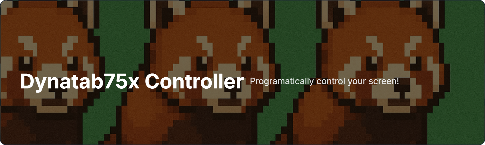
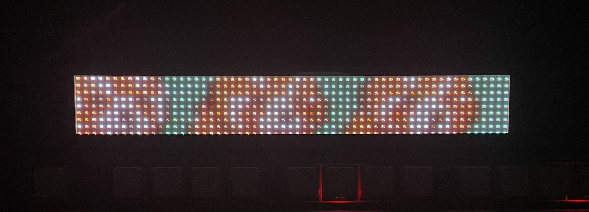
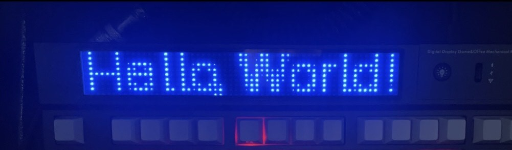

# Dynatab75x Controller



A CLI tool to interact with an [Epomaker Dynatab75x](https://epomaker.com/products/epomaker-dynatab75x) keyboard that comes with a small **60x9 pixel screen** attached.

> ⚠️ This project is still very rough around the edges!  
> ⚠️ NOTE: Currently, this only works over a **USB connection**!

---

**Disclaimer**  
This is an independent, third-party project. It is **not affiliated with, endorsed by, or supported by Epomaker or its parent companies**.  
All trademarks, including "Epomaker" and "Dynatab75x", are the property of their respective owners and are used here solely for the purpose of compatibility and identification.

---

## Features

- Upload images to the Dynatab75x screen
- Send custom text to the screen

---

## Requirements

- Python 3.10 or 3.12
- USB connection to Dynatab75x keyboard

---

## Installation

Using a virtual environment is recommended. Tested with Python 3.10 and 3.12:

```bash
python3.10 -m venv epomaker
source epomaker/bin/activate
pip install EpomakerController
```

---

## Usage

```bash
epomakercontroller
```

Output:

```
Usage: epomakercontroller [OPTIONS] COMMAND [ARGS]...

  A simple CLI for the EpomakerController.

Options:
  --help  Show this message and exit.

Commands:
  dev               Various dev tools.
  upload-animation  Upload an animation to the Epomaker device.
  upload-image      Upload an image to the Epomaker device.
```

---

## VSCode Configurations

This repository includes helpful VSCode launch configurations for running and testing scripts:

- **Upload Default Text**: Automatically sends a default message to the Dynatab screen.
- **Send Custom Text**: Prompts you to input a custom message to send to the screen.
- **Upload Image**: Run image upload workflows directly from the editor.

To use:

1. Open the repo in VSCode.
2. Go to the Run and Debug tab.
3. Select the desired configuration from the dropdown.
4. Hit the play ▶️ button to launch.

You can edit `.vscode/launch.json` to customize or add new run options.

---

## Demo Gallery

Here's a preview of what you can do with EpomakerController:

- ✅ Upload static images to the Dynatab75x screen  
  

- 💬 Display custom aligned text  
  

- 🧠 Create interesting scripts  
  

---

## TODO

- Add support for Bluetooth / 2.4GHz modes
- Support uploading GIFs and animations

---

## Contributing

Contributions are very welcome! Please see the [contributor guide] for more info.

---

## License

Distributed under the terms of the [MIT license][license],  
**EpomakerController** is free and open-source software.

---

## Issues

If you encounter any problems,  
please [file an issue] with a detailed description.

---

<!-- github-only -->

[license]: https://github.com/imp3ga/EpomakerController/blob/main/LICENSE
[contributor guide]: https://github.com/imp3ga/EpomakerController/blob/main/CONTRIBUTING.md
[command-line reference]: https://EpomakerController.readthedocs.io/en/latest/usage.html
